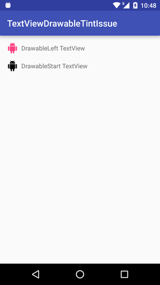

# TextView drawableTint issue
Sample App that showcase the issue that Drawable Tinting is ignored when DrawableStart or DrawableEnd is used.

||

Tested in stock Nexus 5 running Android M (6.0.1)
 Also in stock Nexus 6P running Android M (6.0.1)